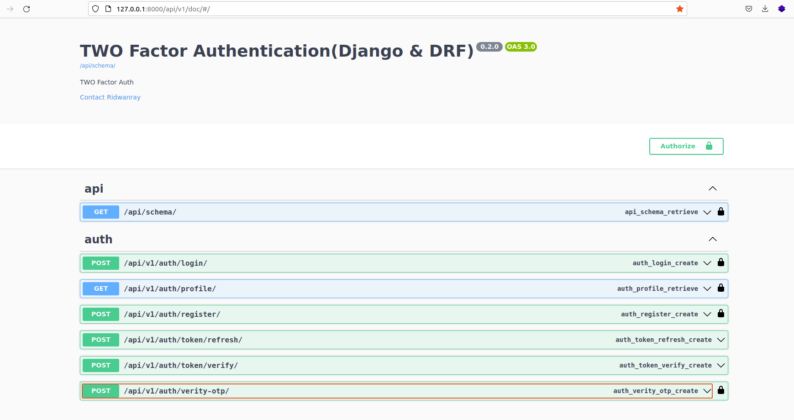
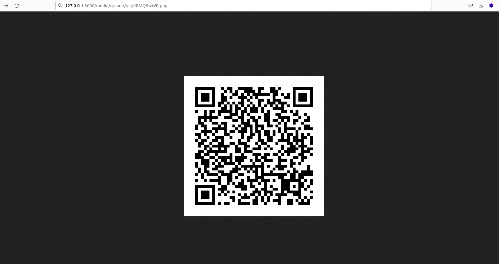
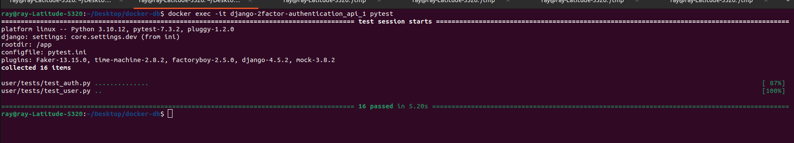

# Django - DRF 2factor Authentication using an Authenticator App
This guide how to implement two-factor authentication in Djanog&DRF using Authenticator Apps <br>
Complete guide [Medium](https://ridwanray.medium.com/implementing-two-factor-authentication-2fa-with-django-and-django-rest-framework-drf-e945163b450a)

## Tools & Services:
- Django & DRF : for building the APIs
- Docker & Docker compose: Containerization
- PostgreSQL: Relational DB


## By the end of this tutorial 
- Understand how Two-Factor Authentication (2FA) works.
- Onboard a user on the system
- Generate a QR code for the user
- Enable users to make a login attempt using valid credentials, such as their email and password.
- Authenticate the user using an offline OTP generated by an Authenticator App.


## Running locally

Create a .env file by copying the .env.sample provided and run:
```
docker compose build && docker compose up
```
to start the container. As an alternative, run:
```
docker-compose -f docker-compose.dev.yml up --build
```
to build and run the container using the dev yaml file.
Make sure to externalize the db instance to be used. It can be in another container.

## Run tests
Run descriptive tests in the container using:
```
docker compose exec <docker_container_name> pytest -rP -vv
```

Access the docs on:

```
http://localhost:8000/api/v1/doc
```


# Doc


# QR code


# Test
